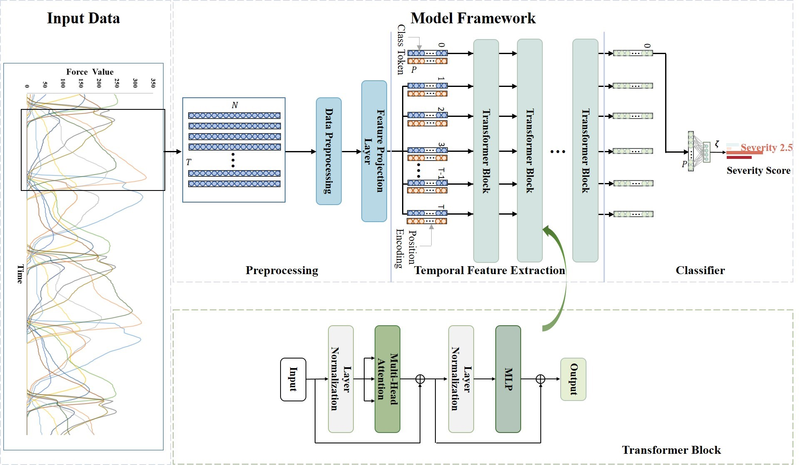

# An Attention-based Temporal Network for Parkinson's Disease Severity Rating using Gait Signals
This project contains pytorch implementation of an attention-based temporal network. 
It has been used to detect Parkinson's disease based on gait signals, 
and the name of the paper is: 'An Attention-based Temporal Network for Parkinson's Disease Severity Rating using Gait Signals'. 
The overall process is shown in the figure below.

## Usage:
    python main.py
